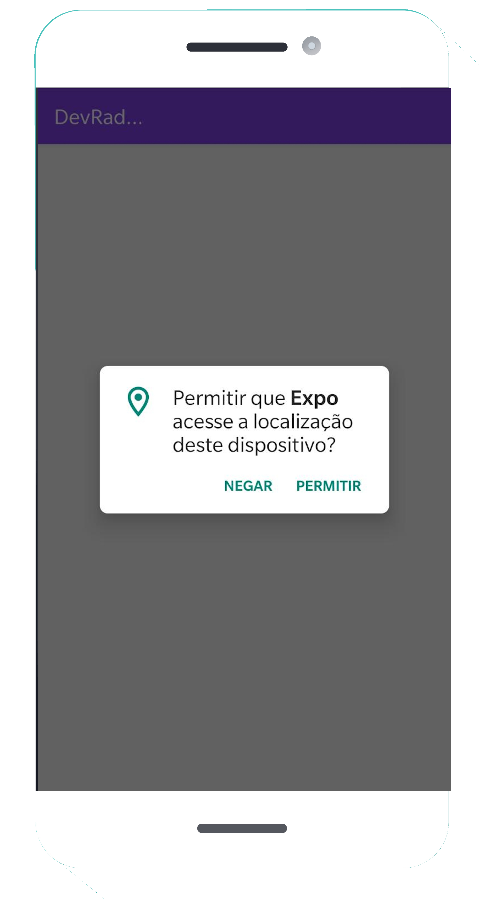
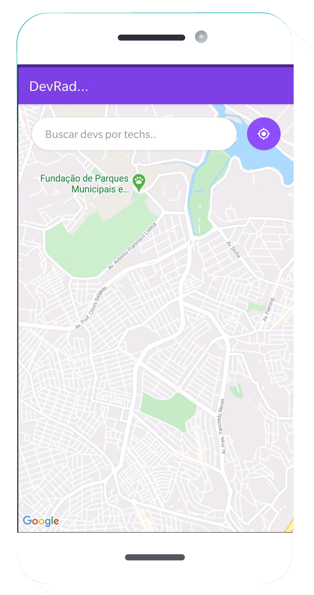

<h1 align="center">
    
</h1>

<h4 align="center">
  🚀 Semana OmniStack 10.0
</h4>

  

  
  
  

  

  

 

  

  
  

## Tecnologias

Esse projeto foi desenvolvido seguindo as tecnologias:

- [Node.js](https://nodejs.org/en/)
- [React](https://reactjs.org)
- [React Native](https://facebook.github.io/react-native/)
- [Expo](https://expo.io/)

## 💻 Projeto

O DevRadar é um projeto que visa conectar desenvolvedores próximos a você que trabalham com as mesmas tecnologias. Realizado durante a 10° omniStack.

## Layout

Imagens utilizadas no projeto pelo link
 <a href="http://www.freepik.com">Designed by rawpixel.com / Freepik</a>

Você pode baixar o layout do projeto no formato `.png` através [desse link](.github/notebook.png).

Para abrir o arquivo no formato `.sketch` em qualquer sistema operacional utilize a ferramenta [Figma](https://figma.com).

## Licença

Esse projeto está sob a licença MIT. Veja o arquivo [LICENSE](LICENSE.md) para mais detalhes.

---

Desenvolvido por Olimpio Pimenta.